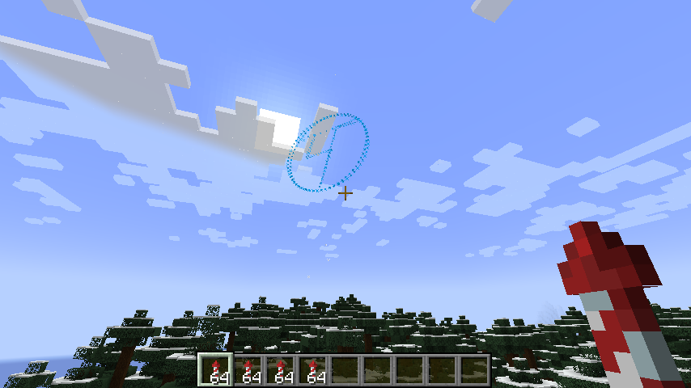
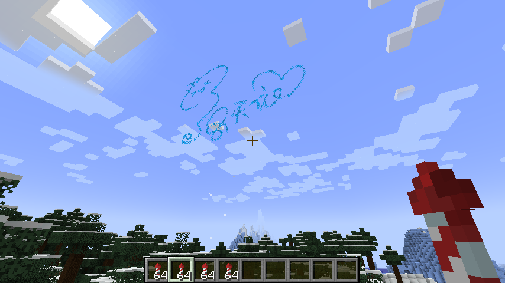
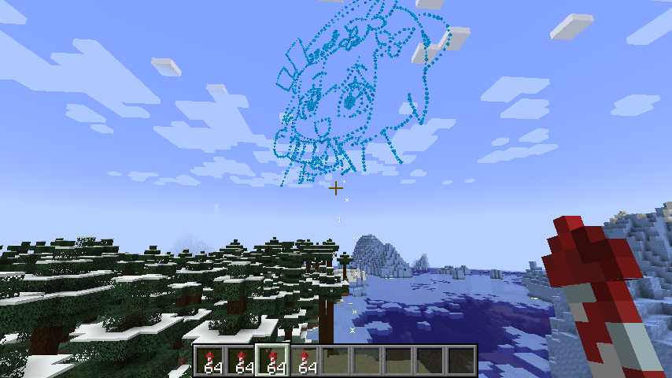
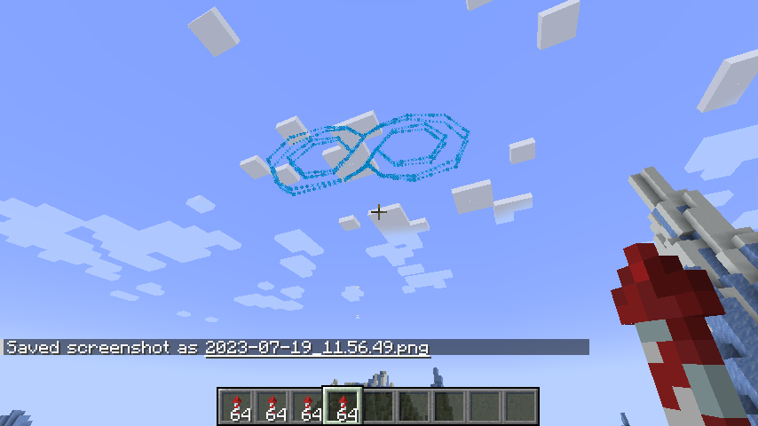
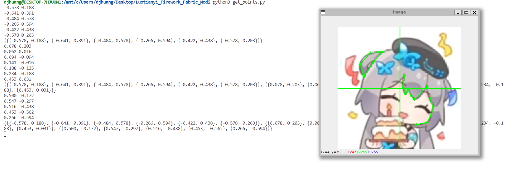

# Luotianyi Friwork Fabric MOD
add 4 firework rocket:
- luotianyi:luo_firework_rocket1 : म
  
- luotianyi:luo_firework_rocket2 : signature
  
- luotianyi:luo_firework_rocket3 : a image
  
- luotianyi:luo_firework_rocket4 : ♾
  

# Fabric Properties
	minecraft_version=1.19.4
	yarn_mappings=1.19.4+build.2
	loader_version=0.14.21

# Dependencies
	fabric_version=0.82.0+1.19.4

# get_points.py
use this script to get points from picture, it will produce oordinates of points that can be passed to `explodePattern` function to custom firework pattern.

